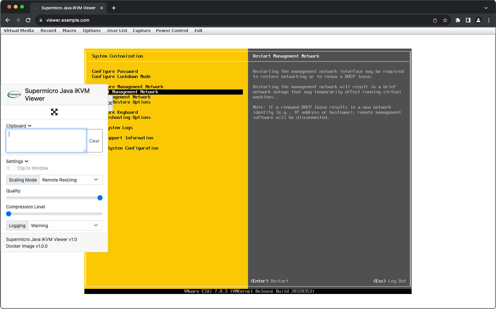
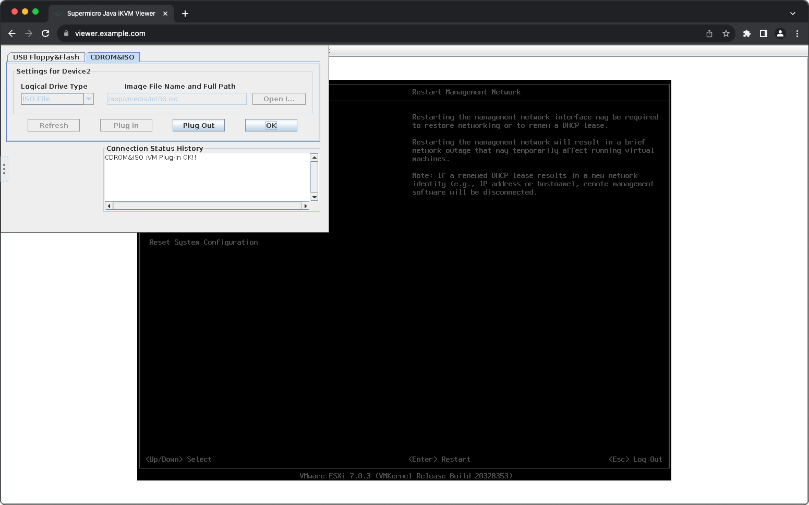

  


# Supermicro Java iKVM Viewer Docker
A Docker container for connecting to Supermicro Java based iKVM Viewers, built from [jlesage/docker-baseimage-gui](https://github.com/jlesage/docker-baseimage-gui). No more hunting down old versions of Java, enabling insecure legacy algorithms, or configuring other solutions such as OpenWebStart or IcedTea-Web on multiple computers. Simply start the container, open your browser, and use your KVM viewer. Please see the [Disclaimers & Current Bugs](#disclaimers-&-current-bugs) before using.

### docker compose
```
version: '3.8'
services:
  supermicro-java-ikvm:
    image: ghcr.io/mistercalvin/supermicro-java-ikvm:latest
    container_name: supermicro-java-ikvm
    environment:
      TZ: UTC
      KVM_HOST: # IP or Hostname
      KVM_USER: # Your IPMI Username
      KVM_PASS: # Your IPMI Password
      DISPLAY_WIDTH: 1024 # Display Width
      DISPLAY_HEIGHT: 768 # Display Height
    ports:
      - 5800:5800 # Web UI Port
      - 5900:5900 # VNC Port
    volumes:
      - ./vmedia:/app/vmedia/ # Virtual Media ISO's
      - ./screenshots:/app/screenshots/ # Screenshots / Recordings
      - supermicro-java-ikvm:/config/ # Persistent Configuration for user preferences
    restart: no

volumes:
  supermicro-java-ikvm:
    name: supermicro-java-ikvm
```

### docker cli

Create a named volume before executing the command below: `docker volume create supermicro-java-ikvm` (this will persist user preferences and iKVM .jar files)

```
docker run -d \
  --name=supermicro-java-ikvm \
  -e TZ="UTC" \
  -e USER_ID="1000" \
  -e GROUP_ID="1000" \
  -e KVM_HOST="" \
  -e KVM_USER="" \
  -e KVM_PASS="" \
  -e DISPLAY_WIDTH="1024" \
  -e DISPLAY_HEIGHT="768" \
  -p 5800:5800 \
  -p 5900:5900 \
  -v ./vmedia:/app/vmedia/ \
  -v ./screenshots:/app/screenshots/ \
  -v supermicro-java-ikvm:/config/
  --restart no \
  ghcr.io/mistercalvin/supermicro-java-ikvm:latest
```

Once the container is online you can access the web interface via the default port of `5800`. If you wish to password protect this page take a look [here](https://github.com/jlesage/docker-baseimage-gui#vnc-password) for steps on how to do so.
  
## User / Group Identifiers
The container allows you to modify the UID & GID of the user (`app`) inside the container. If you would like to know more, please see [this page](https://github.com/jlesage/docker-baseimage-gui#usergroup-ids) for more information on the topic. If you are unsure of what this is I recommend leaving `USER_ID` and `GROUP_ID` at their default values of `1000`, or omitting them from your Docker compose files or run commands.

## Disclaimers & Current Bugs 
- The image has additional environment variables you can customize, take a look at [this page](https://github.com/jlesage/docker-baseimage-gui#environment-variables) for more information. I have not tested the container with any variables other than what is defined in this repo; use these at your own risk.

- This container has only been tested with the following hardware and firmware revision: `Supermicro X9DR3-F Motherboard (Nuvoton WPCM450 BMC), BMC Firmware 3.62 [SMT_X9_362.bin]`, and the details for the current iKVM are: `ATEN iKVM Viewer v1.69.21 [KVM__V1.69.39.0x0.jar]`. This may work with other BMC manufacturers, but if you are having issues (or success) please [let me know](https://github.com/MisterCalvin/supermicro-java-ikvm/issues).

- Selecting Español or Korean from Options > Preference > Language Setting will crash the program, and any attempts to reconnect to the Java viewer will fail. To fix this, login to your server's web interface, then navigate to Maintenance > iKVM Reset. If this does not work you can also reboot the IPMI unit by navigating to Maintenance > Unit Reset. Unfortunately I do not have a fix at this time, but the crash does not occur under Windows, and I could successfully switch the language to the aformentioned options albiet through a very convoluted manner with hit or miss reproducibility, which tells me I should be able to track this bug down and release a fix in the future.

- If you are having issues with the UI upon boot, navigate to Options > Preference > Window and uncheck "Auto-resize window." Unfortunately this settings does not persist across reboots, so each time the container is restarted you will need to repeat this.

- Continuing on the previous point: not all user preferences are saved. Hotkeys, Mouse Settings, and Keyboard settings seem to persist, but all other customization options such as mounted Virtual Media or Video Settings will be lost and need to be changed again if the container is restarted.

- If the container crashes due to an error you must run `docker compose down` before bringing the container back up, or if you are modifying any env variables you must do a full `docker compose down && docker compose up` or `docker stop supermicro-java-ikvm`, otherwise the program will not be able to find the Java class necessary to make the iKVM connection. This will be addressed in a future release.

- The container assumes your server's web interface is accessible via port 80 or port 443. If you are using a non-standard port and are having issues connecting you may need to modify the initialization script at `build/rootfs/etc/cont-init.d/50-setup-ikvm.sh`, specifically line 10, `url="https://$KVM_HOST"`.

## Credits
Big thanks to Walter Doekes for their [ipmikvm-tls2020](https://www.osso.nl/blog/2020/supermicro-java-console-redirection-kvm/) script and research, without their work this project would have taken far longer. Thanks to Jocelyn Le Sage for their [docker-baseimage-gui](https://github.com/jlesage/docker-baseimage-gui) project, and to Dominik for the inspiration from their [docker-idrac6](https://github.com/DomiStyle/docker-idrac6) project.
